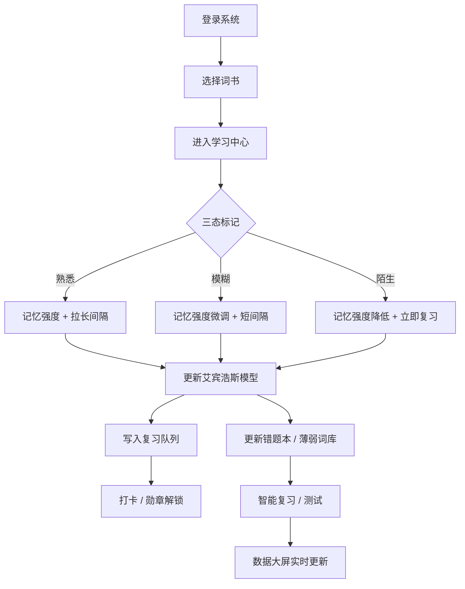

# 智绘记（SmartVocab）— 高端企业级智能图文背单词 Web 系统 PRD

## 1. 产品概述

智绘记 SmartVocab 是一款面向大学生与英语学习者的全场景智能背单词 Web 系统，核心对标百词斩，主打"图文场景化 + AI 记忆算法 + 个人数据大屏"。系统基于艾宾浩斯遗忘曲线自研个性化记忆衰减模型，根据用户错词率、停留时长、复习频次动态生成专属复习节奏，自动沉淀个人薄弱词库与高频错题库；同时提供多套官方词书（专升本 / 四级 / 六级 / 考研 / 高中 / 初中 / 雅思）、智能测试、生词本、笔记、打卡勋章、ECharts 数据大屏等完整商业级功能。

- 目标用户：本科 / 大数据专业毕业生作为毕业设计使用；亦可作为商业化产品运营。
- 核心价值：把"重复刷词"升级为"AI 节奏化 + 数据可视化"的全流程学习闭环。
- 技术愿景：前后端分离 + 企业级分层架构 + 自研核心算法，符合高端毕设评审标准。

## 2. 核心功能

### 2.1 用户角色
| 角色 | 注册方式 | 核心权限 |
|------|----------|----------|
| 普通用户 | 邮箱 + 密码 / 头像自定义 | 学习、复习、测试、查看个人数据大屏、生词本、笔记、打卡 |
| 管理员（预留） | 预置账号 | 词书管理、词条管理、用户管理、统计概览 |

### 2.2 功能模块
1. **首页 / 数据大屏 Dashboard**：今日待复习、学习连续打卡、掌握量趋势、能力雷达。
2. **词书广场 BookSquare**：七大词书分类、词书进度可视化、词书详情。
3. **学习中心 StudyRoom**：图文场景化记单词、熟 / 模糊 / 陌生三态标记、AI 智能复习池。
4. **错题本 ErrorBook**：自动归类、薄弱知识点分析、错题专项复习。
5. **智能测试 QuizRoom**：英译汉、汉译英、选词填空、随机抽题、测试结果分析。
6. **生词本 VocabularyBook**：个人笔记、星级标记、批量复习、批量清空、导出 JSON。
7. **打卡日历 CheckIn**：连续打卡、热力图、勋章成就系统、学习提醒。
8. **个人中心 Profile**：学习档案、头像上传、修改密码、数据统计。
9. **登录 / 注册 / 找回密码 Auth**：JWT 无状态登录、SpringSecurity 权限拦截、密码 BCrypt 加密。

### 2.3 页面与模块详表
| 页面 | 模块 | 功能描述 |
|------|------|----------|
| 登录 | 表单 / 第三方 | 邮箱 + 密码登录、注册、Token 持久化 |
| 首页大屏 | Hero 横幅 / 4 个统计卡 / ECharts 仪表盘 | 学习总览、连续打卡、今日待复习、能力雷达 |
| 词书广场 | 分类标签 / 词书卡片网格 | 切换分类、查看进度、进入学习 |
| 学习中心 | 全屏图文卡 / 释义面板 / 操作栏 | 看图选义、三态标记、播放音标、笔记、收藏 |
| 复习中心 | 智能复习池 | 系统按记忆曲线自动出卡、批量完成 |
| 错题本 | 错误列表 / 知识点归类 | 按词书 / 题型筛选、专项复习 |
| 智能测试 | 题型切换 / 倒计时 / 交卷 | 英译汉、汉译英、选词填空，结束后出报告 |
| 生词本 | 笔记 / 星级 / 批量操作 | 富文本笔记、批量复习、批量清空、导出 |
| 打卡日历 | 月历 / 热力图 / 勋章墙 | 打卡、查看勋章、连续天数 |
| 个人中心 | 资料 / 头像 / 密码 | 头像上传、修改资料、修改密码 |

## 3. 核心流程

### 3.1 学习闭环
1. 用户登录 → 进入词书广场 → 选择词书 → 进入学习中心。
2. 系统按艾宾浩斯算法从该词书调度今日单词 → 展示图文场景。
3. 用户标记 熟悉 / 模糊 / 陌生 → 后端更新记忆模型参数（熟悉度、难度系数、下次复习时间）。
4. 系统实时更新词书进度、累计学习时长、掌握量统计。
5. 用户在打卡日历完成今日打卡 → 解锁勋章。
6. 错题自动归类到错题本 → 触发薄弱词专项复习。
7. 数据大屏每日刷新学习趋势、复习完成率、词书分布。

### 3.2 智能调度
- 后端 cron 每日 02:00 重建用户复习队列。
- 单词复习优先级 = 时间衰减因子 × 错题权重 × 难度系数。
- 智能测试按词书与掌握度动态组卷。

## 4. 用户界面设计

### 4.1 设计风格
- **主色调**：品牌蓝 `#2D6BFF` 配合 知性绿 `#00C896` 作为成长色，背景采用米白 `#F7F8FC`。
- **强调色**：金币金 `#FFB400`（勋章 / 成就）、警示红 `#FF5A5F`（错误率）。
- **按钮风格**：圆角 12px，主按钮带轻微渐变（`#2D6BFF → #5A8DFF`）与 0 12 24 阴影。
- **字体**：标题用 `"Noto Serif SC" / "Sora"`；正文用 `"Plus Jakarta Sans" / "PingFang SC"`；数字用 `"JetBrains Mono"`。
- **布局**：卡片化（Card-based），左侧固定导航 + 顶栏用户信息，整体 12 列栅格。
- **图标**：`lucide-vue-next` 线性图标为主，少量 emoji 强化记忆卡片趣味。
- **动效**：路由切换 200ms 淡入；学习卡片翻牌 3D 动画 600ms；ECharts 入场动画 1000ms。
- **质感**：渐变光斑 + 噪点 + 玻璃拟态（backdrop-filter blur）。

### 4.2 页面设计概述
| 页面 | 模块 | UI 要素 |
|------|------|----------|
| 登录 | 居中卡片 | 渐变背景 + 玻璃拟态卡片，插画点缀 |
| 数据大屏 | 4 卡 + 6 图 | 顶部 KPI 卡 + 6 个 ECharts 图表，霓虹描边 |
| 词书广场 | 分类 + 卡片网格 | 圆角 16px 卡片、进度条、悬浮微动效 |
| 学习中心 | 大图 + 操作栏 | 大图 4:3、操作按钮三态、底部进度条 |
| 错题本 | 列表 + 标签 | 折叠面板、错误次数、薄弱度评分 |
| 测试 | 答题卡 + 计时 | 顶部进度条、卡片化题干、底部提交 |
| 生词本 | 笔记 + 星级 | 笔记富文本、星级按钮、批量操作工具栏 |
| 打卡日历 | 月历 + 热力 | 自定义月历组件、热力图、勋章列表 |
| 个人中心 | 资料 + 统计 | 头像、统计卡、修改表单 |

### 4.3 响应式
- Desktop ≥ 1200 优先；1024–1200 自适应双列；768–1024 折叠侧栏为顶部抽屉；< 768 进入"类 APP"竖屏布局，导航变为底部 Tab Bar。
- 移动端隐藏次要图表、保留核心 KPI 与打卡。

### 4.4 高级动效 / 视觉细节
- 学习中心：全屏图片 + 顶部毛玻璃导航条 + 翻牌 3D 动画 + 底部波浪进度条。
- 数据大屏：图表入场使用 ECharts 渐变 + 数字滚动 + 光斑背景。
- 全局：路由切换使用 `vue-router` transition，loading 使用骨架屏。

## 5. 非功能需求
- 接口统一 JSON 格式 `{ code, message, data }`，HTTP 状态码语义化。
- 全局异常拦截 + 业务异常码 + 日志（Logback + MDC traceId）。
- 接口限流（Redis 滑动窗口，针对登录、提交答案）。
- 安全性：BCrypt 密码、JWT 过期 7 天、RefreshToken、XSS 过滤、SQL 注入通过 MyBatisPlus 防注入。
- 性能：Redis 缓存热门词书、首页大屏 5min 缓存、MySQL 关键字段加索引。
- 部署：Maven 一键打包、Docker Compose（MySQL + Redis + 后端 + 前端 Nginx）。
