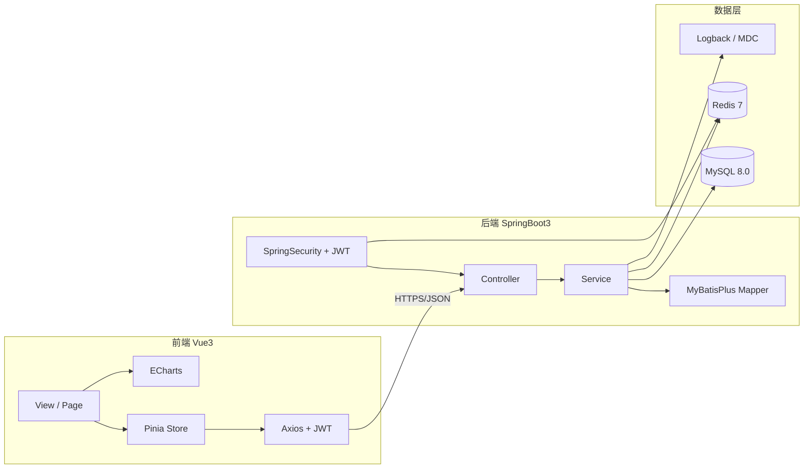
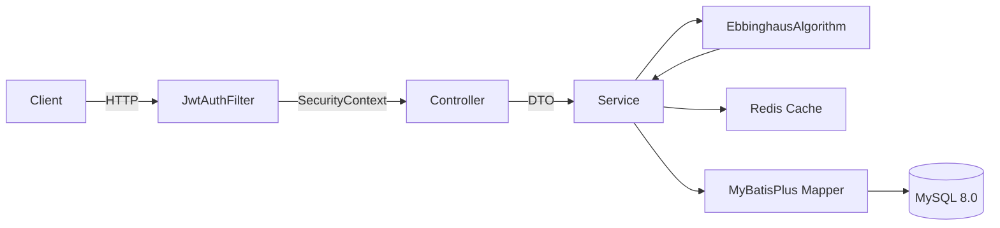
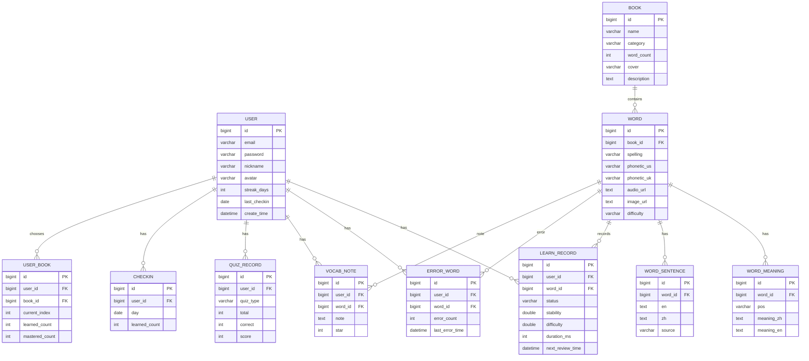

# 智绘记 SmartVocab — Technical Architecture（技术架构）

## 1. 架构设计



## 2. 技术栈描述

- **前端**：Vue 3.4 + Vite 5 + TypeScript + Pinia 2 + Vue Router 4 + Element Plus 2.7 + ECharts 5 + Axios + lucide-vue-next + SCSS。
- **后端**：Spring Boot 3.2 + Spring Security 6 + JJWT 0.12 + MyBatis-Plus 3.5 + Redis (Redisson) + Hutool + Lombok + Validation + Logback。
- **数据库**：MySQL 8.0，utf8mb4，InnoDB，关键字段建索引。
- **部署**：Maven 后端 Jar，Vite 前端静态资源；Docker Compose 一键编排。

## 3. 目录结构

```
英语单词/
├── backend/                    # SpringBoot3 后端
│   ├── src/main/java/com/smartvocab
│   │   ├── SmartVocabApplication.java
│   │   ├── common/             # 统一响应、分页、异常、工具
│   │   ├── config/             # Security / Redis / MyBatisPlus / WebMvc
│   │   ├── security/           # JWT 过滤器、UserDetails
│   │   ├── module/
│   │   │   ├── auth/           # 登录注册
│   │   │   ├── user/           # 用户
│   │   │   ├── book/           # 词书
│   │   │   ├── word/           # 单词 / 释义 / 例句
│   │   │   ├── learn/          # 学习记录 / 复习队列
│   │   │   ├── errorbook/      # 错题
│   │   │   ├── quiz/           # 测验
│   │   │   ├── vocab/          # 生词本
│   │   │   ├── checkin/        # 打卡
│   │   │   ├── stat/           # 统计
│   │   │   └── algorithm/      # 艾宾浩斯算法
│   │   └── ...
│   ├── src/main/resources
│   │   ├── application.yml
│   │   ├── logback-spring.xml
│   │   └── mapper/             # MyBatisPlus XML
│   └── pom.xml
├── frontend/                   # Vue3 前端
│   ├── src
│   │   ├── api/                # Axios 封装 + 各模块 API
│   │   ├── components/         # 通用组件
│   │   ├── views/              # 页面
│   │   ├── stores/             # Pinia
│   │   ├── router/             # 路由 + 守卫
│   │   ├── styles/             # 全局样式 / 主题
│   │   ├── utils/              # 工具
│   │   ├── assets/             # 静态资源
│   │   ├── App.vue
│   │   └── main.ts
│   ├── vite.config.ts
│   ├── package.json
│   └── tsconfig.json
├── db/
│   ├── smartvocab.sql          # 建库 + 建表 + 初始数据
│   └── er_diagram.md           # E-R 图说明
├── docker-compose.yml
└── README.md
```

## 4. 路由定义（前端）

| 路由 | 说明 |
|------|------|
| /login | 登录 |
| /register | 注册 |
| /dashboard | 首页 / 数据大屏 |
| /books | 词书广场 |
| /books/:id | 词书详情 |
| /study/:bookId | 学习中心 |
| /review | 智能复习 |
| /errorbook | 错题本 |
| /quiz | 智能测试 |
| /vocabulary | 生词本 |
| /checkin | 打卡日历 |
| /profile | 个人中心 |
| /404 | 404 |

## 5. API 定义（核心）

所有接口前缀 `/api`，统一 JSON：`{ code: 0, message: "ok", data: any }`。鉴权使用 `Authorization: Bearer <token>`。

| 模块 | 方法 | 路径 | 说明 |
|------|------|------|------|
| 认证 | POST | /auth/register | 注册 |
| 认证 | POST | /auth/login | 登录，返回 token |
| 用户 | GET | /user/me | 当前用户信息 |
| 用户 | PUT | /user/me | 修改资料 |
| 用户 | POST | /user/avatar | 头像上传 |
| 词书 | GET | /books | 词书列表 |
| 词书 | GET | /books/{id} | 词书详情 |
| 词书 | GET | /books/{id}/words | 词书单词分页 |
| 词书 | POST | /books/{id}/choose | 选择学习词书 |
| 学习 | GET | /learn/today | 今日学习任务 |
| 学习 | POST | /learn/record | 提交学习记录 |
| 复习 | GET | /review/today | 今日复习任务 |
| 复习 | POST | /review/record | 提交复习记录 |
| 错题 | GET | /errorbook | 错题列表 |
| 错题 | POST | /errorbook/{wordId}/remove | 移出错题 |
| 测试 | GET | /quiz/generate | 生成测试 |
| 测试 | POST | /quiz/submit | 提交测试 |
| 生词本 | GET | /vocab | 生词本列表 |
| 生词本 | POST | /vocab/{wordId}/note | 修改笔记 |
| 生词本 | POST | /vocab/{wordId}/star | 切换星级 |
| 生词本 | DELETE | /vocab/batch | 批量删除 |
| 生词本 | GET | /vocab/export | 导出 |
| 打卡 | POST | /checkin | 今日打卡 |
| 打卡 | GET | /checkin/calendar | 打卡日历 |
| 打卡 | GET | /checkin/medals | 勋章列表 |
| 统计 | GET | /stat/dashboard | 大屏总览数据 |
| 统计 | GET | /stat/trend | 学习趋势 |
| 统计 | GET | /stat/mastery | 单词掌握分布 |
| 统计 | GET | /stat/weak | 薄弱词分析 |

## 6. 服务端架构（Controller → Service → Mapper）



## 7. 数据模型

### 7.1 核心实体 E-R 图



### 7.2 关键 DDL 摘要（完整见 `db/smartvocab.sql`）

```sql
CREATE TABLE user (
  id BIGINT PRIMARY KEY AUTO_INCREMENT,
  email VARCHAR(64) NOT NULL UNIQUE,
  password VARCHAR(128) NOT NULL,
  nickname VARCHAR(64),
  avatar VARCHAR(255),
  streak_days INT DEFAULT 0,
  last_checkin DATE,
  create_time DATETIME DEFAULT CURRENT_TIMESTAMP
) ENGINE=InnoDB DEFAULT CHARSET=utf8mb4;

CREATE TABLE book (
  id BIGINT PRIMARY KEY AUTO_INCREMENT,
  name VARCHAR(64) NOT NULL,
  category VARCHAR(32) NOT NULL,
  word_count INT DEFAULT 0,
  cover VARCHAR(255),
  description TEXT
) ENGINE=InnoDB DEFAULT CHARSET=utf8mb4;

CREATE TABLE word (
  id BIGINT PRIMARY KEY AUTO_INCREMENT,
  book_id BIGINT NOT NULL,
  spelling VARCHAR(64) NOT NULL,
  phonetic_us VARCHAR(64),
  phonetic_uk VARCHAR(64),
  audio_url VARCHAR(255),
  image_url VARCHAR(255),
  difficulty VARCHAR(8) DEFAULT 'NORMAL',
  KEY idx_word_book (book_id)
) ENGINE=InnoDB DEFAULT CHARSET=utf8mb4;

CREATE TABLE learn_record (
  id BIGINT PRIMARY KEY AUTO_INCREMENT,
  user_id BIGINT NOT NULL,
  word_id BIGINT NOT NULL,
  status VARCHAR(16) NOT NULL,
  stability DOUBLE DEFAULT 1.0,
  difficulty DOUBLE DEFAULT 0.5,
  duration_ms INT DEFAULT 0,
  next_review_time DATETIME,
  create_time DATETIME DEFAULT CURRENT_TIMESTAMP,
  KEY idx_lr_user_word (user_id, word_id),
  KEY idx_lr_review (user_id, next_review_time)
) ENGINE=InnoDB DEFAULT CHARSET=utf8mb4;
```

## 8. 核心算法 — 艾宾浩斯优化模型（可答辩亮点）

实现位于 `backend/.../module/algorithm/EbbinghausEngine.java`：

```
R = e^(-t / S)
nextInterval = -S * ln(targetR)
S_new = S_old * (1 + alpha * (statusScore - 0.5))
D_new = clamp(D_old + beta * (1 - recallQuality), 0.1, 1.0)
```

- `R` 为记忆保留率，`t` 为距上次复习的小时数，`S` 为稳定性。
- `statusScore` 由 熟悉=1.0 / 模糊=0.5 / 陌生=0.1 映射。
- `recallQuality` 综合 错题率、停留时长、复习次数。
- 综合决定 `nextInterval`（下次复习间隔）与 `nextReviewTime`。
- 智能复习池 SQL：`WHERE user_id=? AND next_review_time <= NOW() ORDER BY (1-stability) DESC LIMIT n`。
- 薄弱词：`error_rate > 0.3 AND stability < 0.5`。
- 高频易错：`error_count >= 3`。

## 9. 部署说明

```bash
# 1. 启动 MySQL + Redis
docker compose up -d mysql redis
# 2. 初始化数据
docker compose exec -T mysql mysql -uroot -proot < db/smartvocab.sql
# 3. 后端
cd backend && mvn spring-boot:run
# 4. 前端
cd frontend && npm install && npm run dev
```

Nginx 部署：将 `frontend/dist` 部署到 Nginx，配置 `/api` 反向代理到后端 8080。

## 10. 安全 / 规范

- 全局异常处理 `GlobalExceptionHandler`，统一返回 `code / message`。
- Logback MDC `traceId`，日志包含用户 ID、请求路径、耗时。
- 接口限流：登录、提交答案通过 Redis 滑动窗口（10s/5 次）。
- XSS：前端使用 v-text / 过滤器；后端使用 Hutool HtmlUtil 过滤。
- 密码 BCrypt strength=10，JWT 密钥 256 bit。
