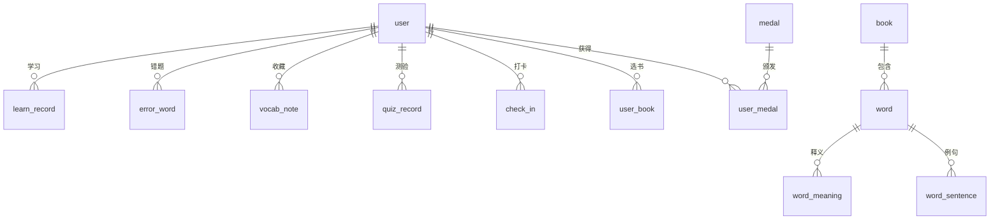

# 数据库 E-R 图说明

## 核心实体关系

| 实体 | 说明 | 关键字段 |
|------|------|----------|
| user | 用户 | id, email, password, streak_days |
| book | 词书 | id, name, category |
| word | 单词 | id, book_id, spelling, image_url |
| word_meaning | 单词释义 | id, word_id, meaning_zh |
| word_sentence | 单词例句 | id, word_id, en, zh |
| user_book | 用户词书进度 | id, user_id, book_id |
| learn_record | 学习记录 | id, user_id, word_id, status, stability |
| error_word | 错题 | id, user_id, word_id, error_count |
| vocab_note | 生词本 | id, user_id, word_id, note, star |
| quiz_record | 测验记录 | id, user_id, quiz_type, score |
| check_in | 打卡 | id, user_id, day |
| medal / user_medal | 勋章 | code, condition_type |

## 关系图（Mermaid）

## 索引策略

- `learn_record(user_id, word_id)` 复合唯一索引，加速"已学/未学"判断。
- `learn_record(user_id, next_review_time)` 智能复习池查询。
- `error_word(user_id, word_id)` 错题去重。
- `word(book_id)` 词书单词分页。

## 字符集与引擎

- 引擎：InnoDB（支持事务、外键、行锁）
- 字符集：utf8mb4 / utf8mb4_unicode_ci（支持 emoji、中文）
- 关键字段 `BIGINT` 主键 `AUTO_INCREMENT`，避免 UUID 性能损耗
